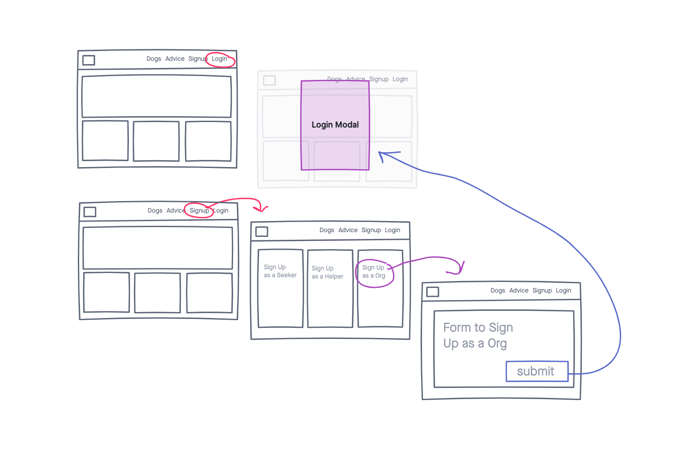
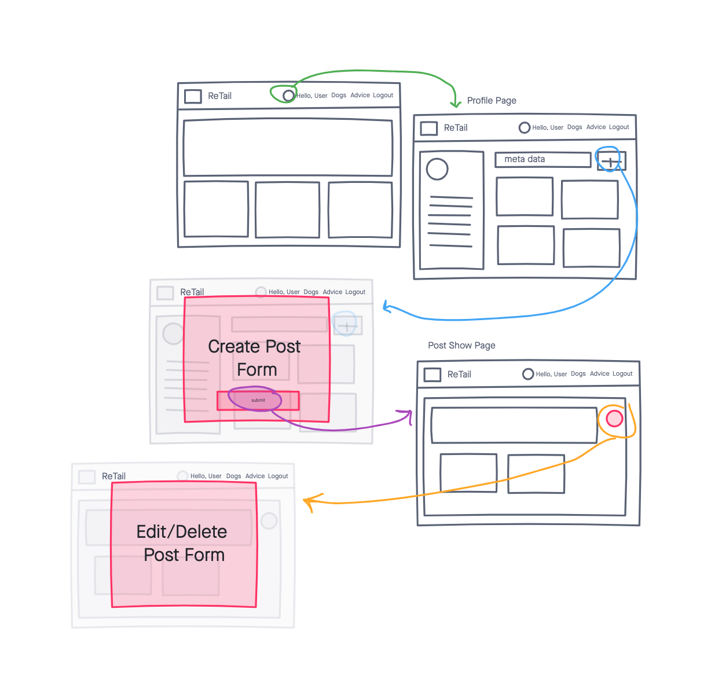
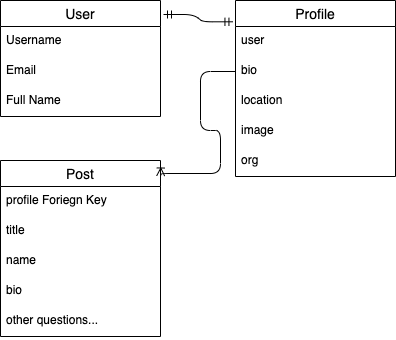

# ReTail

http://retailfordogs.herokuapp.com/

ReTail is a full stack application built for dogs lovers with the goal of keeping dogs out a shelters by finding their forever homes. In this first version of ReTail, users will be able to sign up, login in, maintain a profile page, and create posts for dogs. ReTail was built for three types of users: individuals looking for dogs, individuals who need to rehome dogs, and small rescue organizations.

### Technologies 
ReTail is a full CRUD application with RESTful routing using Django, DTL, and PostgreSQL. I will use Sass with Bootstrap to create custom styling and functionality. 

- PostgreSQL
- Django
- DTL
- Python
- Sass
- Bootstrap 

### User Stories

ReTail is an application build for dog lovers with the goal of keeping rescue dogs out of shelters while trying to find forever homes for our furry friends. 

- SIGN UP/ LOGIN
    - Users can sign up and create an account which will automatically create a profile page for that user. 
    - Sign up with begin with a simple sign up form with username, email,  password, and location.
    - The user will be redirected login and then to the homepage.
    - The navagation bar will dymanically change after login and give the user the ability to view their profile page and logout. 

- PROFILES
    - Users will be able to access their profile page for the link in the navagation bar. 
    - Users will be able to update their profile information, view all their posts, and create posts from their profile page. 
    - All profiles will require authorization to use CRUD functionality. 
    - Profiles can show as much or as little information as the user wants. 
        - individuals can just have the minimum required versus organizations that can have more details profile pages.

- POSTS
    - Users will be able to create, update, and destroy posts for available dogs.
    - Must be logged in to create a post.

- DOGS PAGE
    - Users and non users will be able to view all available dogs for all users. 
    - Users can click on an indivdual post and will be redirected to a detail page to view more information about that dog. 
    
- DOG DETAIL PAGE
    - Users can view more information about an individual dog as well as edit the information and remove the post if that dog is adopted. 

# Wireframes

## Login and SignUp

## Profile and Posts

# ERD

# Future Features
- Make the forms more developed with dropdowns and more error handling
- Make the difference between my three users more distinct (i.e. they have different features based on the user type)
    - find immediate and temporary housing with a foster home
    - allow people to anonymously surrender dogs
    - allow people to find their perfect dog
    - allow small and volunteer rescue organizations to post available dogs with ease

- Search and filter capabilites 
- Integrate a map api to allow filtering by location
- Create an algorithm that uses data in the posts and the dog seekers' profile to suggest matches
- Integrate Filepond to drag and drop images and files into the post form
- Create a Resources page with information on adoption, fostering, surrendering, and general information about dogs for new owners
- Users will be able to favorite a dog and save it to a list
- Add messaging so users can connect through the app
- Password recovery with django
- Add other animals
- Add a foster model and create full CRUD for that model
- Expand Sass usage and work on building the CSS and JavaScript without Bootstrap
- Add a tally about how many applications are open for each dog
- Add application functionality 