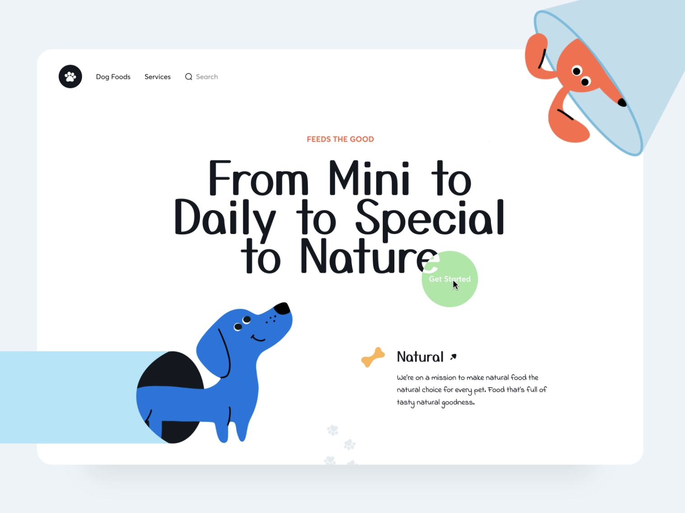

# ReTail

# Scope

I will be building a CRUD application with RESTful routing using PostgreSQL and Django. I will use SASS integration with Bulma to create custom styling. My user goals will be creating models that will allow for filtering options for dog seekers, creating models for different profile types and user experiences, and authorization and authentication for all user types. My post goals will be creating a post model for in depth information on each dog that will be used to filtering and for dog seekers. 

### Feature Creeps

- Integrate a map api to allow filtering by location
- Create an algorithm that uses data in the posts and the dog seekers' profile to suggest matches
- Integrate Filepond to drag and drop images and files into the post form
- Create a Resources page with information on adoption, fostering, surrendering, and general information about dogs for new owners
- Users will be able to favorite a dog and save it to a list
- Comments

# User Stories

ReTail is an application build for dog lovers with the goal of keeping rescue dogs out of shelters while trying to find forever homes for our furry friends. 

### Goals

- keep dogs out of shelters
- find immediate and temporary housing with a foster home
- allow people to anonymously surrender dogs
- allow people to find their perfect dog
- allow small and volunteer rescue organizations to post available dogs with ease

### Features

- SIGN UP
    - Sign up will give you the option to sign up as a rescue organization, anonymous surrender, or a dog seeker
    - Sign up with begin with a simple sign up form with name, email,  password, location, and rescue organization name (if that is the option)
    - The user will be redirected login and then to a profile page which they will be able to set up
- PROFILES
    - All profiles will require authorization to use CRUD functionality on their own profiles alone
    - The profile types will include:
        - Organization - Rescue organization
            - Will include a public rescue profile page
            - The ability to create, update, edit, and delete posts for available dogs
            - Send and receive messages about dogs
        - Helper - Anonymous Surrender
            - Will include a public or private profile page where you can create, update, edit, and delete posts for available dogs
            - Find a foster home or rescue in your area for immediate rehoming if necessary
            - Send and receive messages about dogs
        - Seeker - Dog Seeker
            - Will include public or profile that will have information about their home life and dog wants
            - Convert their profile into a application for a dog (feature creep)
            - Like/Save dogs they are interested in (feature creep)
            - Send and receive messages about dogs
        - Foster (feature creep)
            - Will be seed data for the moment
    - POSTS
        - Users will be able to create, update, and destroy posts for available dogs
        - Must be logged in to create a post
    - DOG SHOW PAGE
        - Users and non users will be able to view and filter through available dogs

# Wireframes

## Login and SignUp


## Profile and Posts


# Inspiration




# Data Models

## ERD


## Models

```jsx
class User(Model):
  username = TextField(max_length=250, unique=True)
  email = TextField(max_length=250, unique=True)
  fullname = TextField(max_length=250, unique=True)

class Profile(Model):
  user = models.OneToOneField(settings.AUTH_USER_MODEL, on_delete=models.CASCADE, related_name='user')
  bio = CharField(max_length=1500, blank=True)
  image = TextField(max_length=500, blank=True, default="https://")
  location = TextField(max_length=500)
  org = TextField(max_length=500, blank=True)

class Post(Model):
  profile = models.ForeignKey('profile', on_delete=CASCADE)
  title = TextField(max_length=500, blank=False, default="https://")
  image = TextField(max_length=500, blank=False, default="https://")
  bio = CharField(max_length=1500, blank=False)
  friendly = BooleanField(default=False, blank=True)
  kids = BooleanField(default=False, blank=True)
  PUPPY = 'PU'
  ADULT = 'AD'
  SENIOR = 'SR'
  AGE_CHOICES = [
    ('PUPPY', 'Puppy'),
    ('ADULT', 'Adult'),
    ('SENIOR', 'Senior')
  ]
  age_choices = CharField(max_length=2), choices=AGE_CHOICES, default=PUPPY 
  breed_choices = choices.field
  size_choices = choices.field
  health_choices = choices.field
  active_choices = choices.field
  available = BooleanField(default=False, blank=False)

model User {
  email    String    @unique
  name     String?   @default("Friend")
  user_id  Int       @id @default(autoincrement())
  Post_Post_authorToUser      Post[] @relation("Post_authorToUser")
  // Post_Post_favoritedByToUser Post[] @relation("Post_favoritedByToUser")
  profile  profile
}

model Profile {
  bio        String?
	name       String?
  location   String?
  profile_id Int     @id @default(autoincrement())
  user_id    Int     @unique
  user      User   @relation(fields: [user_id], references: [user_id])
}

model Post {
  id         Int        @id @default(autoincrement())
  createdAt  DateTime   @default(now())
  user       User   @relation(fields: [author_id], references: [user_id])
  // favoritedBy User @relation("Post_favoritedByToUser", references: [user_id])
  title      String @db.VarChar(250)
  name       String
  bio        String @db.VarChar(15000)
  friendly   Boolean @default(false)
  kids       Boolean @default(false)
  age        String
  breed      String
  size       String
  health     String
  active     Boolean @default(false)
  available  Boolean @default(false)
 }
```

# Routes

[Routes](https://www.notion.so/05217a86c17d44a9b78111586260e854)

# Milestones

## Sprint One

- Set up an application with Prisma
- Create a PostgreSQL database
- Create Models for User, Profile, Post, and Message
- Test Models

## Sprint Two

- Create Routes
- Test Routes
- Add frontend frameworks
- Create custom SASS with Bulma
- Create EJS files
- Test EJS files

## Sprint Three

- Create forms in EJS pages
- Authorization and Authentication
- Build in filtering options for dog show route

## Sprint Four

- Lots of CSS (bulma and sass)
- Testing
- Feature Creeps

# Feasibility Study

- Prisma
- Filepond
